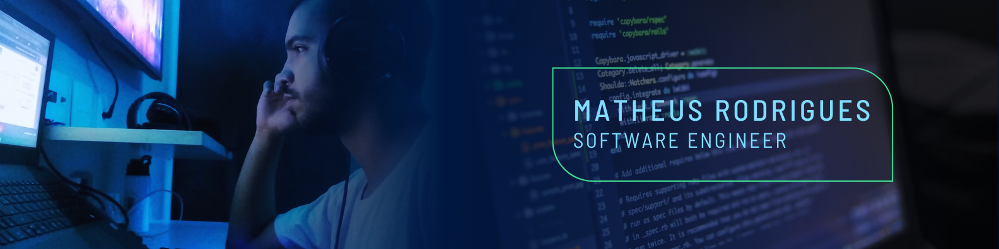

  

  

<h2>👋 Oie! Eu sou o Matheus</h2>

**`Desenvolvedor FullStack`**

💡 Formado em Engenharia de Software pela UFMS com base em desenvolvimento backend, engenharia de dados e soluções escaláveis.

🚀 Sou apaixonado por tecnologia e inovação, sempre buscando aprimorar minhas habilidades e acompanhar as melhores práticas do mercado. Meu foco atual está no desenvolvimento web full stack, com aplicações utilizando HTML, CSS, JavaScript e frameworks modernos.

#

<h3>🤖 Stack</h3>

  
  <!-- 
   -->
  
  
  
  
  

<h3>Contato</h3>

   
  
  

#

  
  

<picture align="center">
  <source media="(prefers-color-scheme: dark)" srcset="https://raw.githubusercontent.com/mari4souza/mari4souza/output/github-contribution-grid-snake-dark.svg">
  <source media="(prefers-color-scheme: light)" srcset="https://raw.githubusercontent.com/mari4souza/mari4souza/output/github-contribution-grid-snake-dark.svg">
  
</picture>

